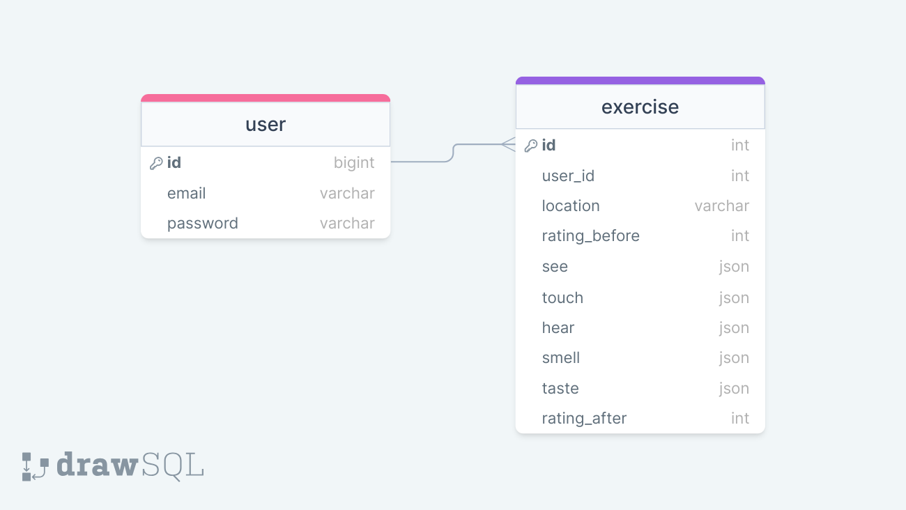

# Project Title

5 Things

## Overview

5 Things is an anti-anxiety app that walks users through a common anti-anxiety exercise that asks them to stop and name:

- 5 things they can see
- 4 things they can touch
- 3 things they can hear
- 2 things they can smell
- 1 thing they can taste

### Problem

Although this anti-anxiety exercise is very useful, if you're feeling very anxious it can be hard to slow your thoughts to do this practice. By entering each step of the exercise into the app, users can be more mindful. It's also difficult to track the exerise's effectiveness over time, but by saving data, users can track progress over time and draw connections between events and anxiety.

### User Profile

This app will be for anyone who struggles with anxious thoughts, whether mild or more severe. Though this app is not a treatment for anxiety, the exercise is useful for everyone.

### Features

- users can create an account to be able to keep a record of all their exercise instances
- users can review past exercises and look for patterns and improvement
- app will ask user to fill in each step of the exercise in forms
- app will ask user to rate their anxiety severity before and after doing the exercise
- app will ask where the user is during the exercise

## Implementation

### Tech Stack

- React
- MySQL
- Express
- Client libraries:
  - react
  - react-router
  - axios
- Server libraries:
  - knex
  - express
  - tbd for authentification

### APIs

- no external APIs

### Sitemap

- Home page
- Login
- Register
- Exercise
- User profile

### Mockups

Provide visuals of your app's screens. You can use tools like Figma or pictures of hand-drawn sketches.

### Data



### Endpoints

**GET /exercise**

- Get list of previous exercise entries

Parameters:

- user_id
- exercise questions

Response:

```
[
    {
        "id": 1,
        "user_id": 1,
        "date": (timestamp),
        "location", "home",
        "rating_before": 5,
        "see": ["one", "two", "three", "four", "five"],
        "touch": ["one", "two", "three", "four"],
        "hear": ["one", "two", "three"],
        "smell": ["one", "two"],
        "taste": ["one"],
        "rating_after": 2,
    },
    ...
]
```

**POST /exercise**

- Add new exercise entry

Parameters:

- user_id
- exercise questions

Response:

```
[
    {
        "id": 1,
        "user_id": 1,
        "date": (timestamp),
        "location", "home",
        "rating_before": 5,
        "see": ["one", "two", "three", "four", "five"],
        "touch": ["one", "two", "three", "four"],
        "hear": ["one", "two", "three"],
        "smell": ["one", "two"],
        "taste": ["one"],
        "rating_after": 2,
    },
    ...
]
```

**POST /users/register**

- Add a user account

Parameters:

- email: User's email
- password: User's provided password

Response:

```
{
    "token": "seyJhbGciOiJIUzI1NiIsInR5cCI6IkpXVCJ9.eyJzdWIiOiIxMjM0NTY3ODkwIiwibmFtZSI6I..."
}
```

**POST /users/login**

- Login a user

Parameters:

- email: User's email
- password: User's provided password

Response:

```
{
    "token": "seyJhbGciOiJIUzI1NiIsInR5cCI6IkpXVCJ9.eyJzdWIiOiIxMjM0NTY3ODkwIiwibmFtZSI6I..."
}
```

### Auth

Yes, tbd

## Roadmap

- create client with boilerplate pages and routing

- create server with express and routes

- create migrations

- create seeds with pre-filled exercises and users for testing

- deploy server and client

- Feature: Create form for exercise

  - HTML form
  - POST endpoint

- Feature: Create user profile with past exercises

  - Implement page
  - GET endpoint

- Feature: Homepage

- Feature: Create account

  - Create form for register page
  - POST/users/register endpoint

- Feature: Login

  - Create form for login page
  - POST/users/login endpoint

- Feature: About page

  - info on how the exercise works and links to mental health resources

- Auth

  - tbd

- Bug fixes

- DEMO DAY

## Nice-to-haves

- forgot password function
- custom graphics for displaying exercise data
- additional page that delivers endpoint of randon mindfulness exercise as a quick version of exercise
- add additional notes or thoughts to exercise
