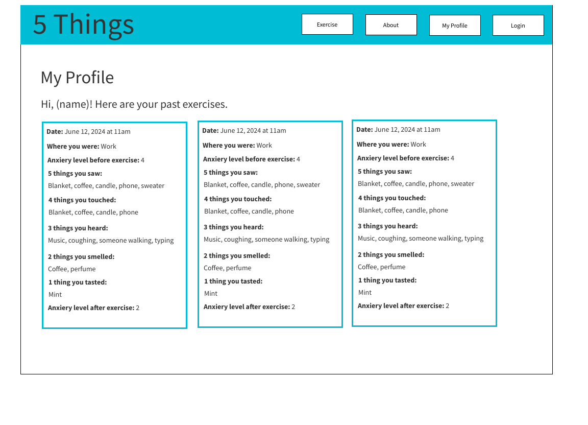

# Project Title

5 Things

## Overview

5 Things is an anti-anxiety app that walks users through a common anti-anxiety exercise that asks them to stop and name:

- 5 things they can see
- 4 things they can touch
- 3 things they can hear
- 2 things they can smell
- 1 thing they can taste

### Problem

Although this anti-anxiety exercise is very useful, if you're feeling very anxious it can be hard to slow your thoughts to do this practice. By entering each step of the exercise into the app, users can be more mindful. It's also difficult to track the exerise's effectiveness over time, but by saving data, users can track progress over time and draw connections between events and anxiety.

### User Profile

This app will be for anyone who struggles with anxious thoughts, whether mild or more severe. Though this app is not a treatment for anxiety, the exercise is useful for everyone.

### Features

- users can create an account to be able to keep a record of all their exercise instances
- users can review past exercises and look for patterns and improvement
- users can search past exercises
- users can earn badges by completing more exercises
- app will ask user to fill in each step of the exercise in forms
- app will ask user to rate their anxiety severity before and after doing the exercise
- app will ask where the user is during the exercise

## Installation Instructions

Get this code as well as the [server repository.](https://github.com/laurenstrapagiel/5things-server)

For the client:

- Run `npm i`
- Run `npm start`

For the server:

- Run `npm i`
- Create a .env file following the env.example file, with a database called 5Things
- Generate a secret_key by running `node -e "console.log(require('crypto').randomBytes(32).toString('hex'));"` and add it to the .env
- run `npx knex migrate:latest`
- run `npx knex seed:run`
- run `npm start`

Once both client and server and ready and running, register your own account or login with `username: lauren` and `password: lauren` to see a sample profile.

## Implementation

### Tech Stack

- React
- MySQL
- Express
- Client libraries:
  - react
  - react-router
  - axios
- Server libraries:
  - knex
  - express
- bcrypt for password hashing

### APIs

- no external APIs

### Sitemap

- Home page
- Login
- Register
- Exercise
- User profile
- About

### Mockups

#### Home Page


#### About Page


#### Login Page


#### Register Page


#### Profile Page



#### Exercise Page


### Screenshots

#### Home Page


#### About Page


#### Login Page


#### Register Page


#### Profile Page


#### Exercise Page


### Data


### Endpoints

**GET /exercise/**

- Get list of previous exercise entries

Parameters:

- user_id
- exercise questions
- token: JWT used to see personal exercises

Response:

```
[
    {
        "id": 1,
        "user_id": 1,
        "date": (timestamp),
        "location", "home",
        "rating_before": 5,
        "see_1": "one",
        "see_2": "two",
        "see_3": "three",
        "see_4": "four",
        "see_5", "five",
        "touch_1": "one,"
        "touch_2": "two",
        "touch_3": "three",
        "touch_4": "four",
         "hear_1": "one",
        "hear_2": "two",
        "hear_3": "three",
        "smell_1": "one",
        "smell_2": "two",
        "taste_1": "one",
        "rating_after": 2,
    },
    ...
]
```

**POST /exercise**

- Add new exercise entry

Parameters:

- user_id
- exercise questions
- token: JWT

Response:

```
[
    {
         "id": 1,
        "user_id": 1,
        "date": (timestamp),
        "location", "home",
        "rating_before": 5,
        "see_1": "one",
        "see_2": "two",
        "see_3": "three",
        "see_4": "four",
        "see_5", "five",
        "touch_1": "one,"
        "touch_2": "two",
        "touch_3": "three",
        "touch_4": "four",
         "hear_1": "one",
        "hear_2": "two",
        "hear_3": "three",
        "smell_1": "one",
        "smell_2": "two",
        "taste_1": "one",
        "rating_after": 2,
    },
    ...
]
```

**GET /profile**

- See user details
- See user's part exericses

Parameters:

- user's id

Response:

```
[
    {
        "id": 1,
        "username": lauren,
        "date": (timestamp),
        "location", "home",
        "rating_before": 5,
        "see_1": "one",
        "see_2": "two",
        "see_3": "three",
        "see_4": "four",
        "see_5", "five",
        "touch_1": "one,"
        "touch_2": "two",
        "touch_3": "three",
        "touch_4": "four",
         "hear_1": "one",
        "hear_2": "two",
        "hear_3": "three",
        "smell_1": "one",
        "smell_2": "two",
        "taste_1": "one",
        "rating_after": 2,
    },
    ...
]
```

**POST /register**

- Add a user account

Parameters:

- username: user's username
- password: User's provided password

Response:

```
{
    "token": "seyJhbGciOiJIUzI1NiIsInR5cCI6IkpXVCJ9.eyJzdWIiOiIxMjM0NTY3ODkwIiwibmFtZSI6I..."
}
```

**POST /login**

- Login a user

Parameters:

- username: User's username
- password: User's provided password

Response:

```
{
    "token": "seyJhbGciOiJIUzI1NiIsInR5cCI6IkpXVCJ9.eyJzdWIiOiIxMjM0NTY3ODkwIiwibmFtZSI6I..."
}
```

### Auth

- JWT auth
  - will start with fake user account before adding auth for testing
  - store JWT in local storage, remove when user logs out
  - user profile will have a message to sign in if not already

## Roadmap

- create client with boilerplate pages and routing

- create server with express and routes

- create migrations

- create seeds with pre-filled exercises and users for testing

- deploy server and client

- Feature: Create form for exercise

  - HTML form
  - POST endpoint

- Feature: Create user profile with past exercises

  - Implement page
  - GET endpoint

- Feature: Homepage

- Feature: Create account

  - Create form for register page
  - POST/users/register endpoint

- Feature: Login

  - Create form for login page
  - POST/users/login endpoint

- Feature: About page

  - info on how the exercise works and links to mental health resources

- Feature: JWT tokens

  - Server: Update expected requests / responses on protected endpoints
  - Client: Store JWT in local storage, include JWT on axios calls

- Bug fixes

- DEMO DAY

## Future additions

- forgot password function
- custom graphics for displaying exercise data
- additional page that delivers endpoint of randon mindfulness exercise as a quick version of exercise
- add additional notes or thoughts to exercise
- use CSS animations to create a box breathing exercise
- light/dark mode toggle
